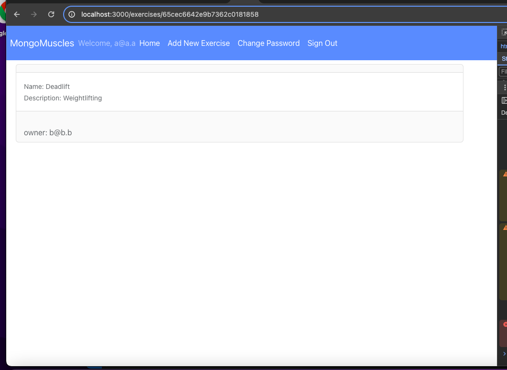
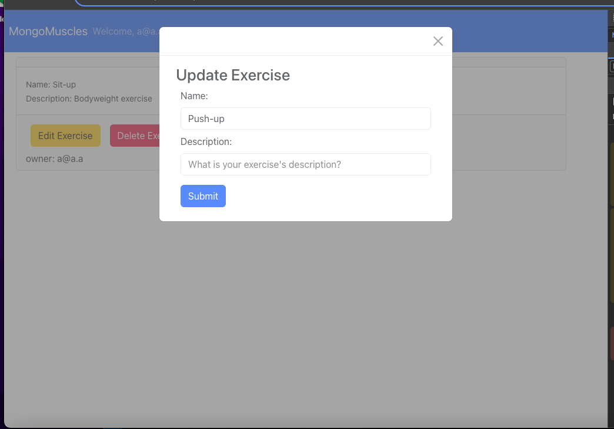
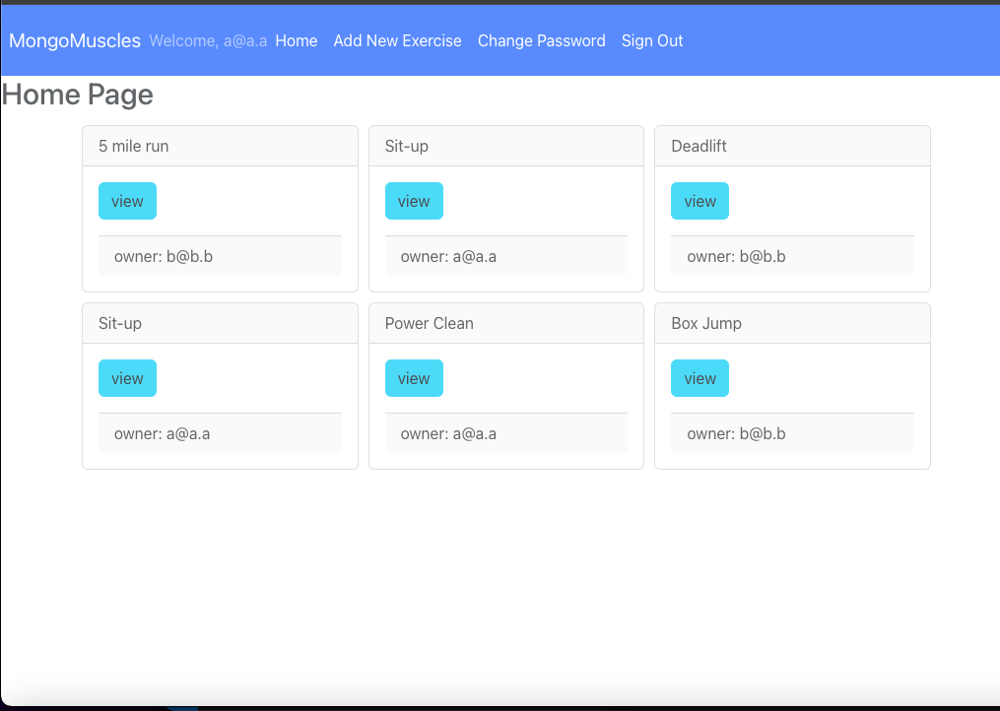

## MongoMuscles 
MongoMuscles is a full-stack fitness application designed to guide your workout journey. Whether you're a fitness enthusiast or just starting, MongoMuscles helps you discover exercises to meet your fitness goals.

URL: https://mongomuscles.netlify.app/

Consumes the MongoMuscles API found [here](https://github.com/Jbuckley3/MongoMusclesAPI)

## User Stories

### User Authentication

#### As a user:

- I want to sign up for Mongomuscles
- I want to sign into my account 
- I want to change my password
- I want to sign out of my account

### Exercises

#### As a user:

- I want to view a list of all exercises 
- I want to view details of a specific exercise 
- I want to be able to add a new exercise
- I want to be able to edit any exercises that I have added
- I want to be able delete any exercises that I have added

### Icebox

#### As a user:
- I would like to add an exercise to create custom workouts
- I would like to view a list of pre-built workouts 

## Wireframes

Main "Show" page with navigation bar 

Modal to Update an Exercise

Index Page showing all exercises

## Technologies Used

- MERN Stack - Client 
- React
- Node.js
- Token Authentication
- CSS, Bootstrap
